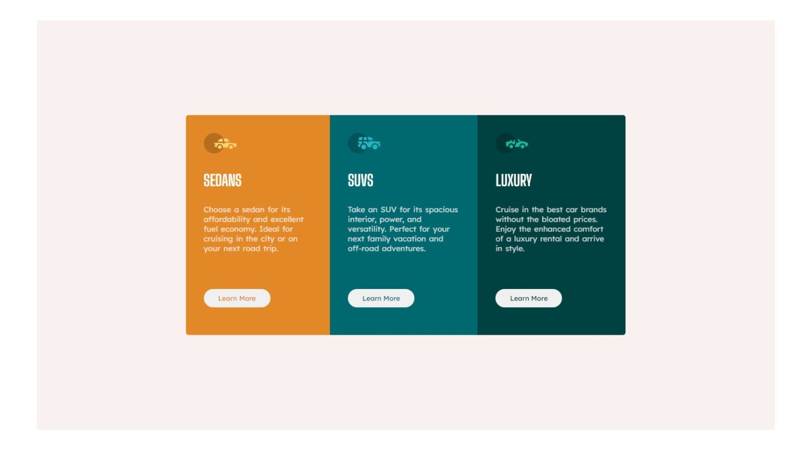

# Frontend Mentor - 3-column preview card component solution

This is a solution to the [3-column preview card component challenge on Frontend Mentor](https://www.frontendmentor.io/challenges/3column-preview-card-component-pH92eAR2-). Frontend Mentor challenges help you improve your coding skills by building realistic projects. 

## Table of contents

- [Overview](#overview)
  - [The challenge](#the-challenge)
  - [Screenshot](#screenshot)
  - [Links](#links)
- [My process](#my-process)
  - [Built with](#built-with)
  - [What I learned](#what-i-learned)
  - [Continued development](#continued-development)
  - [Useful resources](#useful-resources)
- [Author](#author)
- [Acknowledgments](#acknowledgments)

## Overview

### The challenge

Users should be able to:

- View the optimal layout depending on their device's screen size
- See hover states for interactive elements

### Screenshot

### Links

- Solution URL: [Add solution URL here](https://your-solution-url.com)
- Live Site URL: [Add live site URL here](https://your-live-site-url.com)

## My process

### Built with

- Semantic HTML5 markup
- CSS custom properties
- Flexbox

### What I learned

I have learnt how to build a responsive site for different screen sizes. I have also learnt how to use the flexbox layout, use google fonts for styling and also build a custom website with images.

### Continued development

I intend to cntinue building webpages with CSS flexbox, grid layout and the box layout until i am very confident in my ability.

### Useful resources

- [Example resource 1](https://flexboxfroggy.com/) - This helped me to practics CSS flexbox. I really liked its lessons and will use it going forward to sharpen my knowledge on flexbox.
- [Example resource 2](https://www.freecodecamp.org/learn/responsive-web-design/) - This is an amazing website to learn web design. I learnt quite a lot from freecodecamp.

## Author

- Website - [HENRY UGOCHUKWU OKAM](https://github.com/mchenryspagg)
- Frontend Mentor - [@mchenryspagg](https://www.frontendmentor.io/profile/mchenryspagg)
- Twitter - [@mchenryspagg](https://www.twitter.com/mchenryspagg)

## Acknowledgments

Special acknowledge to Zuri and Ingressive for Good which was the bootcamp that initially gave me this task to work on thereby helping me to test my skills by building webpages.
