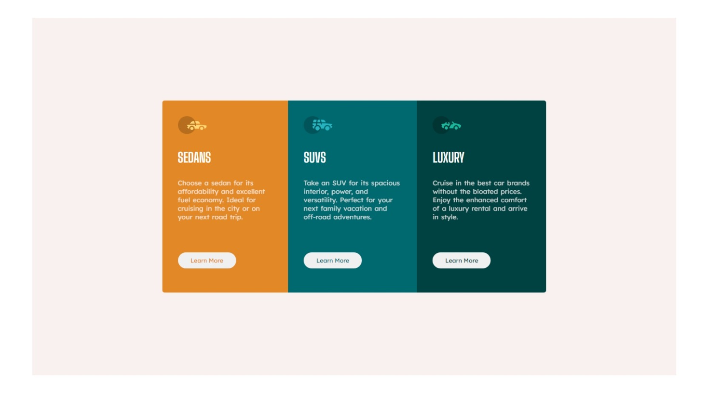

# Frontend Mentor - 3-column preview card component solution

This is a solution to the [3-column preview card component challenge on Frontend Mentor](https://www.frontendmentor.io/challenges/3column-preview-card-component-pH92eAR2-). Frontend Mentor challenges help you improve your coding skills by building realistic projects. 

## Table of contents

- [Overview](#overview)
  - [The challenge](#the-challenge)
  - [Screenshot](#screenshot)
  - [Links](#links)
  - [Built with](#built-with)
  - [What I learned](#what-i-learned)
  - [Continued development](#continued-development)
  - [Useful resources](#useful-resources)
- [Author](#author)
- [Acknowledgments](#acknowledgments)

## Overview

### The challenge

Users should be able to:

- View the optimal layout depending on their device's screen size
- See hover states for interactive elements

### Screenshot

### Links

- Solution URL: [Click here for solution URL](https://github.com/mchenryspagg/Frontend-Mentor-3-column-preview-card-component)
- Live Site URL: [Click here for live site URL](https://mchenryspagg.github.io/Frontend-Mentor-3-column-preview-card-component/)

### Built with

- Semantic HTML5 markup
- CSS custom properties
- Flexbox

### What I learned

I have learnt how to build a responsive site for different screen sizes. I have also learnt how to use the flexbox layout, use google fonts for styling and also build a custom website with HTML and CSS.

### Continued development

I intend to continue building webpages with CSS flexbox, and to also work on other projects that would test my understanding of CSS grid layout, box layout and Javascript until i am confident enough in my ability to start applying for internships and junior developer roles

### Useful resources

- [Example resource 1](https://flexboxfroggy.com/) - This helped me to fully understand the application of CSS flexbox after using so many materials and websites to attempt learning it. I really liked its lessons and will use it going forward to sharpen my knowledge on flexbox.
- [Example resource 2](https://www.freecodecamp.org/learn/responsive-web-design/) - This is an amazing website to learn web design. I learnt quite a lot from freecodecamp and i am yet to complete the certificate course which i will keep in mind.

## Author

- Website - [HENRY UGOCHUKWU OKAM](https://github.com/mchenryspagg)
- Frontend Mentor - [@mchenryspagg](https://www.frontendmentor.io/profile/mchenryspagg)
- Twitter - [@mchenryspagg](https://www.twitter.com/mchenryspagg)

## Acknowledgments

Special acknowledgement to Zuri and Ingressive for Good(14G) which was the bootcamp that initially gave me this task to work on thereby helping me to test my skills by building webpages. Also special thanks to AltschoolAfrica - the bootcamp that introduced me into the world of computer science, programming and web development. And lastly special thanks to DevCareer Africa which gave me the opportunity to use the progate platform to build the essential fundamentals that has brought me this far and going.
